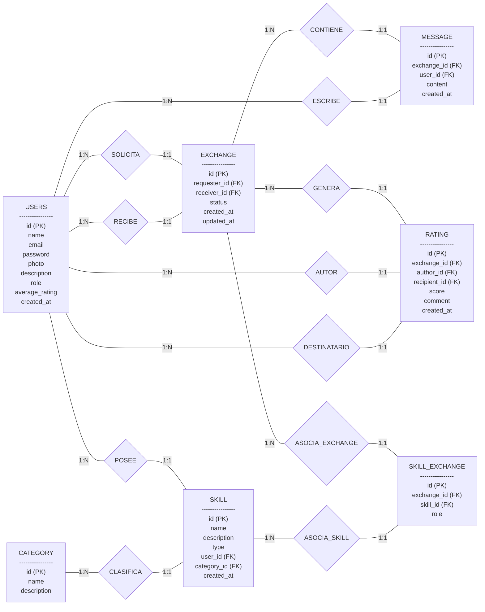

# FASE DE DESEÑO

- [FASE DE DESEÑO](#fase-de-deseño)
- [Fase de Deseño — Swaply](#fase-de-deseño--swaply)
  - [1. Diagrama da arquitectura](#1-diagrama-da-arquitectura)
  - [2. Casos de uso](#2-casos-de-uso)
    - [Usuarios](#usuarios)
    - [Administrador](#administrador)
  - [3. Diagrama de Base de Datos](#3-diagrama-de-base-de-datos)
    - [Modelo Entidad/Relación](#modelo-entidadrelación)
    - [Modelo Relacional](#modelo-relacional)
  - [4. Deseño de interface de usuarios](#4-deseño-de-interface-de-usuarios)
    - [Landing page](#landing-page)
    - [Perfil de usuario](#perfil-de-usuario)

# Fase de Deseño — Swaply

## 1. Diagrama da arquitectura

## 2. Casos de uso

### Usuarios

### Administrador

## 3. Diagrama de Base de Datos

### Modelo Entidad/Relación

### Modelo Relacional

## 4. Deseño de interface de usuarios

### Landing page

### Perfil de usuario

>
[**<-Anterior**](../../README.md)
